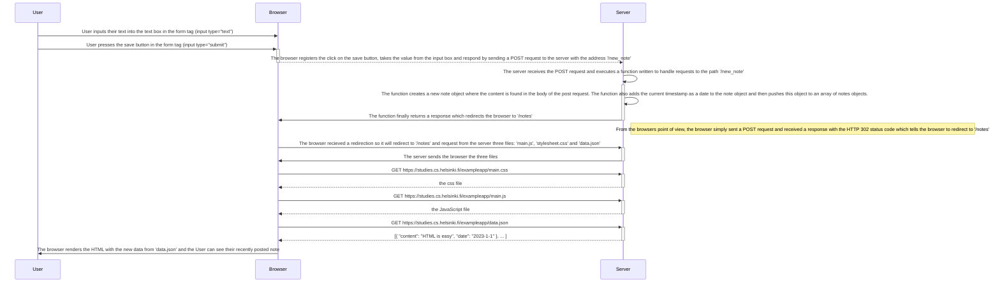

```mermaid
sequenceDiagram
    participant User
    participant Browser
    participant Server
    
    User->>Browser: User inputs their text into the text box in the form tag (input type="text")
    User->>+Browser: User presses the save button in the form tag (input type="submit")
    Browser-->>-Server: The browser registers the click on the save button, takes the value from the input box and respond by sending a POST request to the server with the address '/new_note'

    Server->>+Server: The server receives the POST request and executes a function written to handle requests to the path '/new_note'
    Server->>Server: The function creates a new note object where the content is found in the body of the post request. The function also adds the current timestamp as a date to the note object and then pushes this object to an array of notes objects.
    Server->>-Browser: The function finally returns a response which redirects the browser to '/notes'
    Note right of Server: From the browsers point of view, the browser simply sent a POST request and received a response with the HTTP 302 status code which tells the browser to redirect to '/notes'

    Browser->>+Server: The browser recieved a redirection so it will redirect to '/notes' and request from the server three files: 'main.js', 'stylesheet.css' and 'data.json'
    Server->>-Browser: The server sends the browser the three files

    Browser->>+Server: GET https://studies.cs.helsinki.fi/exampleapp/main.css
    Server-->>-Browser: the css file
    
    Browser->>+Server: GET https://studies.cs.helsinki.fi/exampleapp/main.js
    Server-->>-Browser: the JavaScript file

    Browser->>+Server: GET https://studies.cs.helsinki.fi/exampleapp/data.json
    Server-->>-Browser: [{ "content": "HTML is easy", "date": "2023-1-1" }, ... ]
    
    Browser->>User: The browser renders the HTML with the new data from 'data.json' and the User can see their recently posted note
```
