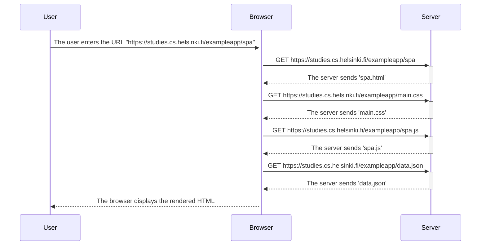

```mermaid
sequenceDiagram
  participant User
  User->>+Browser: The user enters the URL "https://studies.cs.helsinki.fi/exampleapp/spa"
  Browser->>+Server: GET https://studies.cs.helsinki.fi/exampleapp/spa  
  Server-->>-Browser: The server sends 'spa.html'
  Browser->>+Server: GET https://studies.cs.helsinki.fi/exampleapp/main.css  
  Server-->>-Browser: The server sends 'main.css'
  Browser->>+Server: GET https://studies.cs.helsinki.fi/exampleapp/spa.js  
  Server-->>-Browser: The server sends 'spa.js'
  Browser->>+Server: GET https://studies.cs.helsinki.fi/exampleapp/data.json  
  Server-->>-Browser: The server sends 'data.json'
  Browser-->>User: The browser displays the rendered HTML
```
