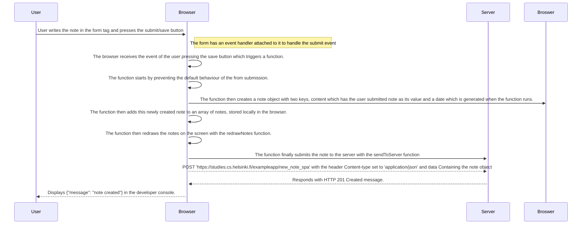

```mermaid
sequenceDiagram
  participant User
  participant Browser
  participant Server

  User->>+Browser: User writes the note in the form tag and presses the submit/save button
  Note right of Browser: The form has an event handler attached to it to handle the submit event
  Browser->>Browser: The browser receives the event of the user pressing the save button which triggers a function.
  Browser->>Browser: The function starts by preventing the default behaviour of the from submission.
  Browser->>Broswer: The function then creates a note object with two keys, content which has the user submitted note as its value and a date which is generated when the function runs. 
  Browser->>Browser: The function then adds this newly created note to an array of notes, stored locally in the browser.
  Browser->>Browser: The function then redraws the notes on the screen with the redrawNotes function.
  Browser->>+Server: The function finally submits the note to the server with the sendToServer function
  Browser-->>+Server: POST 'https://studies.cs.helsinki.fi/exampleapp/new_note_spa' with the header Content-type set to 'application/json' and data Containing the note object
  Server-->>+Browser: Responds with HTTP 201 Created message.
  Browser-->> User: Displays {"message": "note created"} in the developer console.
```

